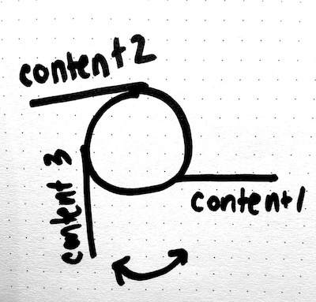

# Multi-Marker Rotation Example

This example shows a demo of using multiple markers to rotate content on-screen. The basic idea is that we place different markers around a bottle, and use the currently-tracked marker to determine what onscreen content we should display.

We arrange the content on panels positioned around the cylinder, and then rotate the cylinder as we detect the real-life markers. The effect is that we feel like we're manipulating a virtual bottle with our real-life bottle!

 

## Markers
The markers used in this example include:
* Built-in [Hiro marker](https://github.com/jeromeetienne/AR.js/blob/master/data/images/HIRO.jpg)
* Built-in [Kanji marker](https://github.com/artoolkit/artoolkit5/blob/master/doc/patterns/Kanji%20pattern.pdf)
* A custom umbrella marker (image and patt file found in `markers` folder)

We printed the markers at about 1 inch by 1 inch to start, but may experiment with different or smaller markers in the future.

## Bottle setup

We glued the markers around our bottle as seen in the photos. Our marker order for this sample was "Hiro", "Kanji" and then "Umbrella". So whenever Hiro was tracked, we showed the first piece of content. Whenever Kanji was tracked, we showed the second piece of content, etc.

 

## Files
* `adjusted-rotation.js`
     -  This is a convenience component that transforms our marker entity's orientation to be what we visually expect when we see it tracked on-screen. By default, the marker's orientation is a flat plane where up is positive Y. In our camera view, we perceive the marker as facing us, with "up" being positive Z. 
* `content-fan.js`
     -  This component displays content around cylinder. We can specify the number of content pieces, and the component will appropriately position them around a cylinder of a certain radius. This component also has 2 useful functions, `animateToContent(index)`, which will animate the cylinder's rotation to display content at a given index, and `animateContentOffset(offset)` which will rotate the cylinder by a small amount (in case we want to give the impression of a "wiggle" when the tracked-marker is moved a bit).
* `multi-marker-rotation-interpolator.js`
     -  This component performs multi-marker tracking. You can add it to an entity that has multiple markers as children, and it will identify what index the last-tracked marker is at. It will also calculate a normalized (0-1) "offset" value for the currently-tracked marker. This corresponds to how much the currently tracked marker is being rotated about the y-axis (for a "wiggle" effect"). This component emits 2 events that can be used to control content, `onTagTriggerIndex(index)`, which is emitted whenever a new marker is tracked, and `onTagRotation`, which is emitted when the current marker has changed rotation.
* `multi-marker-twist.js`
     -  This connects our events emitted from the `multi-marker-rotation-interpolator` component to control the content displayed with the `content-fan` component
* `multi-marker-twist.html`
     -  This sets up the basic HTML, including a persistent `content-fan` and our group of markers
     
     
## Dev Notes

(more elaboration to be added later)

* To get the illusion that we're controlling the marker with the bottle, we actually need to reverse the indices of our "content" items
* We should animate our "wiggle" for the slightly rotation movement effect
* [Add notes about rotating to closest content]

     
     

