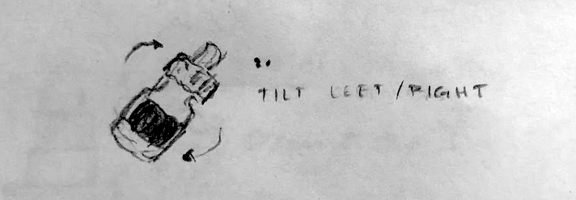

# Rotation Example

This example shows a demo of using a single marker to detect rotation events. When the detected Hiro marker is rotated left or right, the model will change color for a brief moment (to either red or blue).

Download and print the [Hiro marker here](https://github.com/jeromeetienne/AR.js/blob/master/data/images/HIRO.jpg).

## To run the example

From the repository root, run `npm run dev:rotation`

## Files
* `rotation-marker.html`
     -  Sets up the basic A-Frame scene that tracks a Hiro marker and displays a cube and animating torus
     -  Includes required scripts
* `rotation-trigger.js`
     -  A custom A-Frame component that emits events if the marker is rotated right or left (about the z-axiz)
* `rotation.js`
     -  Simple js file that adds event handlers to `markerFound`, `markerLost`
     -  Also adds event handlers for our custom events, `rotated-left` and `rotated-right`

## How does it work?

(More to be added)

We calculate the change in the marker's rotation frame-to-frame and calculate a "rotation rate" for each axis. If the rotation rate exceeds a certain threshold, we will emit a rotation events. Currently, we only emit events for rotation on the Z-axis, but this could easily be extended.

We also apply basic smoothing and debouncing to our event detection. These can be tuned to your heart's desire.

## How do I run this on mobile?
TBAdded!
